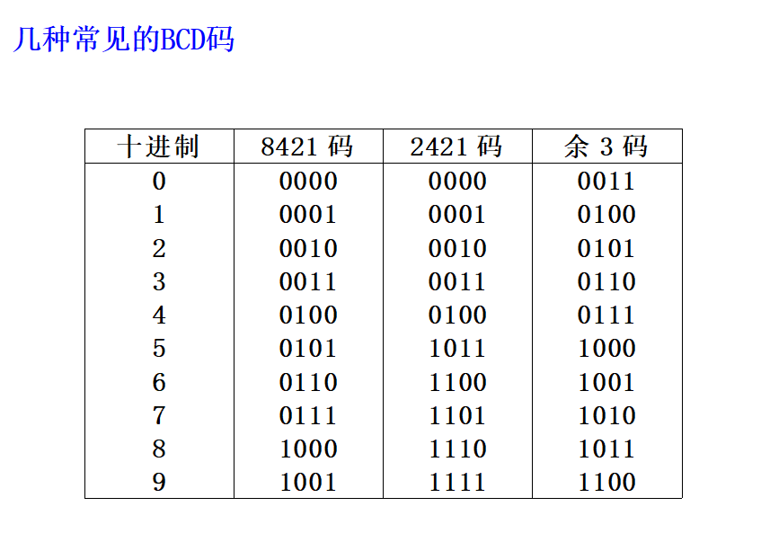
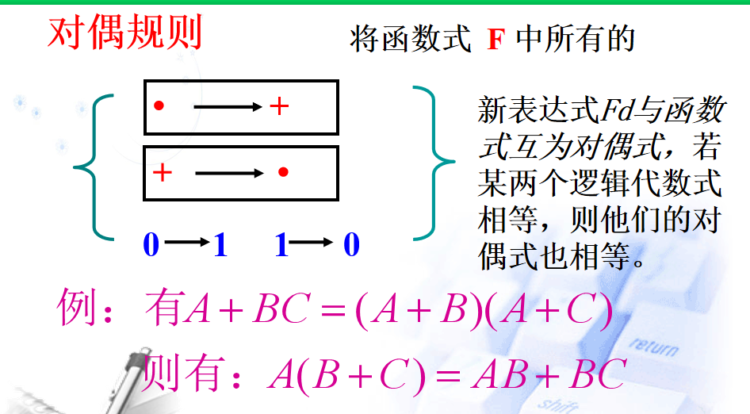
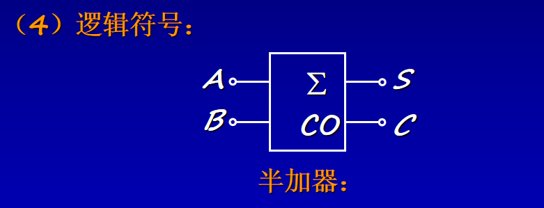
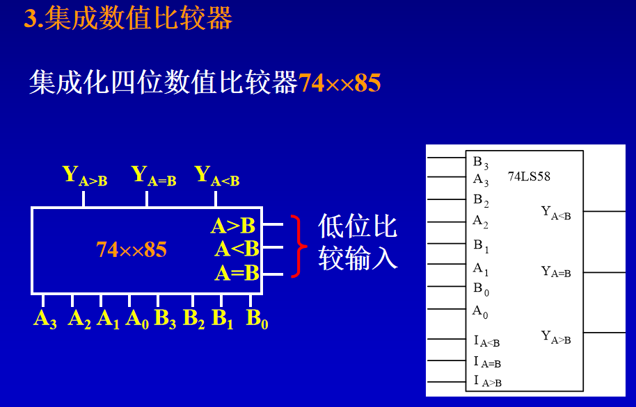
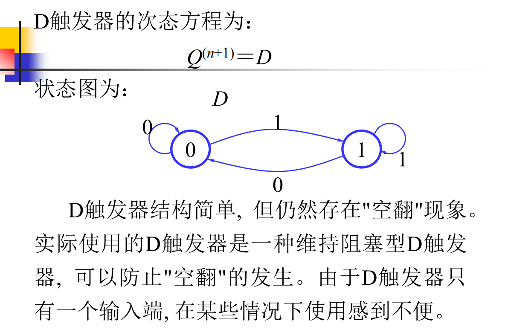
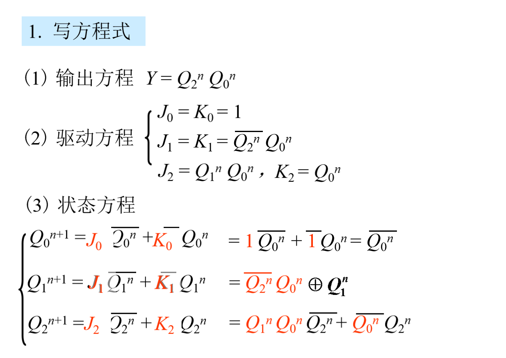
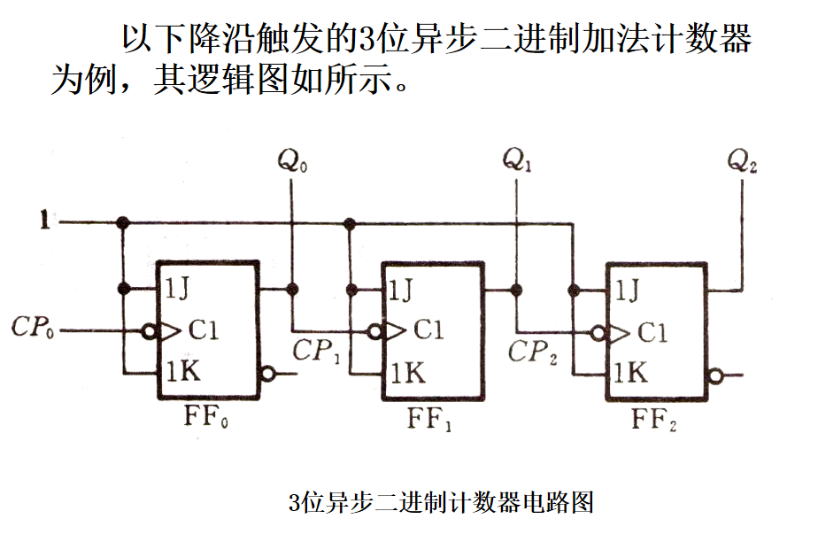

# 信息编码

## 进制转换

## 原码

## 补码	

## 反码

## 总结

## BCD编码

# 布尔代数

## 逻辑符号

## 根据真值表建立函数式

## 基本定理

## 3个规则

## 逻辑函数化简

### 最小项（取真值表为1的组装）

### 最大项（取真值表为0的组装）

### 最大项和最小项的转换

## 电路图的化简

## 卡诺图化简

# 组合逻辑电路

# 时序逻辑电路

## 分析

## 设计

## 常见时序逻辑电路

### 计数器

### 寄存器

