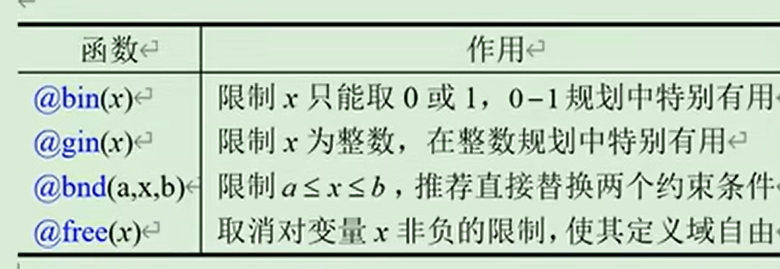
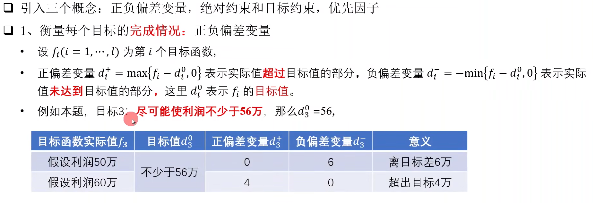
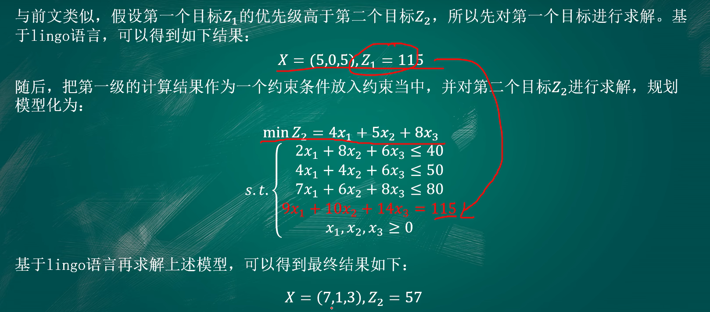
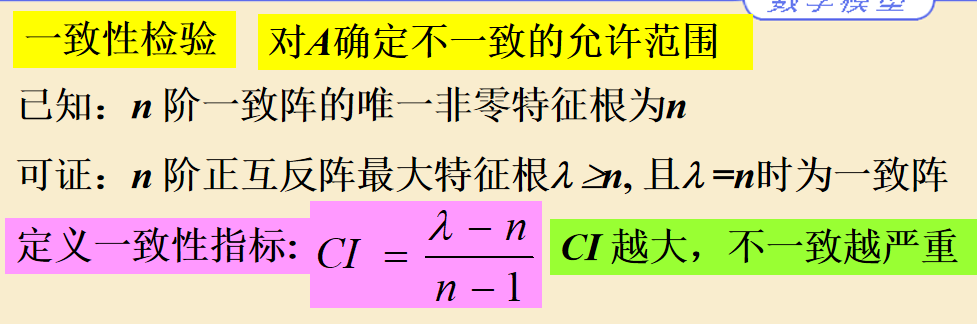
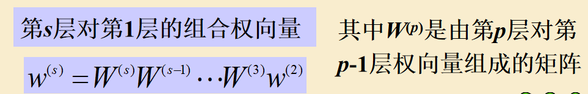

# Lingo

1、变量不区分大小写

2、 变量x默认大于等于0，如果不想要这样，用free

3、注释：!开始 ; 结束

```
!这是一段注释;
```

## 矩阵

**一维矩阵与赋值**

factory和plant名字随便取


**二维矩阵与赋值**

Cooperation名字随便取


## for循环 sum求和


## 逻辑运算符


**例子**


## if判断


## 变量定界函数



## 数学函数


## 集合操作函数


# 线性规划（LP）

## 引例


### Matlab


```matlab
c=[-72 -64];A=[1 1;12 8;3 0];b=[50;480;100];
[x,f]=linprog(c,A,b,[],[],zeros(2,1))
```

### Lindo

```lindo
max 72x1+64x2
st
x1+x2<50
12x1+8x2<480
3x1<100
end
```


### Lingo

```lingo
Model:
Max=72*x1+64*x2;
x1+x2<50;
12*x1+8*x2<480;
3*x1<100;
end
```


# 非线性规划（NLP）

ppt去看

lingo也可以直接求解，和线性规划一样


# 多目标规划

用lingo的话只能转为单目标规划

**一般不存在最优解，存在非劣解（帕累托解）**

## 基本概念




**题目：**


## 常见方法

### 线性加权法


### 优先级法


### 理想点法


### 其他算法


### 遗传算法

### 实例

**题目：**


**解答：**

**线性加权**


**优先级法**



**理想点法**


**遗传算法**


# 插值

## 一维插值


### 例子：

```matlab
hours=1:12;
temps=[5 8 9 15 25 29 31 30 22 25 27 24];

h=1:.1:12;
t=interp1(hours,temps,h) ;

plot(hours,temps,'+',h,t) ;
title('线性插值下的温度曲线');
xlabel('Hour'),ylabel('Degrees Celsius') ;
```

```matlab
x0=linspace(-5,5,11); % 取11个点x
y0=1./(1+x0.^2);  % 11个点的y
x=linspace(-5,5,100);  % 样条插值的x
y=interp1(x0,y0,x,'spline');  % 样条插值的y

x1=linspace(-5,5,100);  % 原函数的图像的x，用于画图
y1=1./(1+x1.^2);  % 原函数的图像的y，用于画图

plot(x1,y1,'k',x0,y0,'+',x,y,'r');
```

### 龙格现象

```matlab
function y=lagr1(x0,y0,x)
n=length(x0); m=length(x);
for i=1:m
   z=x(i);
   s=0.0;
   for k=1:n
      p=1.0;
      for j=1:n
         if j~=k
            p=p*(z-x0(j))/(x0(k)-x0(j));
         end
      end
      s=p*y0(k)+s;
   end
   y(i)=s;
end

```

```matlab

hold on ; % 维持一个图形窗口

m=101; % 原函数
x=-5:10/(m-1):5;
y=1./(1+x.^2);
z=0*x; % 0线
plot(x,z,'r',x,y,'LineWidth',1.5) ; % 设置线条宽度
gtext('y=1/(1+x^2)') ; % 暂停标点

n=3;
x0=-5:10/(n-1):5;
y0=1./(1+x0.^2);
y1=lagr1(x0,y0,x);
plot(x,y1,'b'),gtext('n=2') ;


n=5;
x0=-5:10/(n-1):5;
y0=1./(1+x0.^2);
y2=lagr1(x0,y0,x);
plot(x,y2,'b:'),gtext('n=4');


n=7;
x0=-5:10/(n-1):5;
y0=1./(1+x0.^2);
y3=lagr1(x0,y0,x);
plot(x,y3,'r'),gtext('n=6');

n=9;
x0=-5:10/(n-1):5;
y0=1./(1+x0.^2);
y4=lagr1(x0,y0,x);
plot(x,y4,'r:'),gtext('n=8');


n=11;
x0=-5:10/(n-1):5;
y0=1./(1+x0.^2);
y5=lagr1(x0,y0,x);
plot(x,y5,'m'),gtext('n=10');

```

## 二维插值


### 例子

```matlab
x=1:5;
y=1:3;
temps=[82 81 80 82 84;79 63 61 65 81;84 84 82 85 86];
mesh(x,y,temps)

xi=1:0.2:5;
yi=1:0.2:3;
zi=interp2(x,y,temps,xi,yi','cubic');
figure(2)
mesh(xi,yi,zi)

```

### 网格类型（山体）

```matlab
x=0:400:5600;
y=0:400:4800;
z=[370 470 550 600 670 690 670 620 580 450 400 300 100 150 250;
      510 620 730 800 850 870 850 780 720 650 500 200 300 350 320;
      650 760 880 970 1020 1050 1020 830 900 700 300 500 550 480 350;
      740 880 1080 1130 1250 1280 1230 1040 900 500 700 780 750 650 550;
      830 980 1180 1320 1450 1420 1400 1300 700 900 850 840 380 780 750;
      880 1060 1230 1390 1500 1500 1400 900 1100 1060 950 870 900 930 950;
      910 1090 1270 1500 1200 1100 1350 1450 1200 1150 1010 880 1000 1050 1100;
      950 1190 1370 1500 1200 1100 1550 1600 1550 1380 1070 900 1050 1150 1200;
      1430 1430 1460 1500 1550 1600 1550 1600 1600 1600 1550 1500 1500 1550 1550;
      1420 1430 1450 1480 1500 1550 1510 1430 1300 1200 980 850 750 550 500;
      1380 1410 1430 1450 1470 1320 1280 1200 1080 940 780 620 460 370 350;
      1370 1390 1410 1430 1440 1140 1110 1050 950 820 690 540 380 300 210;
      1350 1370 1390 1400 1410 960 940 880 800 690 570 430 290 210 150];

figure(1);  % 原图
meshz(x,y,z) ; % meshz 函数可以在网格图的周围添加一道围幕
xlabel('X'),ylabel('Y'),zlabel('Z')

xi=0:50:5600;
yi=0:50:4800;

figure(2) % 第一幅
z1i=interp2(x,y,z,xi,yi','nearest');
surfc(xi,yi,z1i) ; % 比mesh好看一些，还有等高线
xlabel('X'),ylabel('Y'),zlabel('Z')

figure(3) % 第二幅
z2i=interp2(x,y,z,xi,yi');
surfc(xi,yi,z2i)
xlabel('X'),ylabel('Y'),zlabel('Z')

figure(4) % 第三幅
z3i=interp2(x,y,z,xi,yi','cubic');
surfc(xi,yi,z3i)
xlabel('X'),ylabel('Y'),zlabel('Z')


figure(5) % 等高线图
subplot(1,3,1),contour(xi,yi,z1i,10,'r');
subplot(1,3,2),contour(xi,yi,z2i,10,'r');
subplot(1,3,3),contour(xi,yi,z3i,10,'r');

```

### 散点类型


```matlab

clear
x=[129 140 103.5 88 185.5 195 105.5 157.5 107.5 77 81 162 162 117.5];
y=[7.5 141.5 23 147 22.5 137.5 85.5 -6.5 -81 3 56.5 -66.5 84 -33.5];
z=[-4 -8 -6 -8 -6 -8 -8 -9 -9 -8 -8 -9 -4 -9];

cx=75:0.5:200;
cy=-70:0.5:150;
cz=griddata(x,y,z,cx,cy','cubic');

meshz(cx,cy,cz),rotate3d
xlabel('X'),ylabel('Y'),zlabel('Z')


figure(2),contour(cx,cy,cz,[-5 -5]);grid % 画出5英尺深的等高线
hold on
plot(x,y,'+')
xlabel('X'),ylabel('Y')


```

# 回归

## 多元线性回归

注意：二次项，交叉项等也算作多元线性回归

**主要matlab函数 ： regress**

```matlab
clc; clear ;
y1=[22.1,15.4,11.7,10.3,11.4,7.5,13,12.8,14.6,18.9,19.3,30.1,28.2,25.6,37.5,36.1,39.8,44.3]';
y2=[7.2,5.4,7.6,2.5,2.4,1.7,4.3,3.7,3.9,7,6.8,10.1,9.4,7.9,14.1,14.5,14.9,15.6]';
x1=[1.89,1.94,1.95,1.82,1.85,1.78,1.76,1.76,1.75,1.74,1.7,1.7,1.68,1.6,1.61,1.64,1.67,1.68]';
x2=[6.1,6.2,6.3,8.2,9.8,10.3,10.5,8.7,7.4,6.9,5.2,4.9,4.3,3.7,3.6,3.1,1.8,2.3]';

X = [ones(size(x1)) x1 x2] ;
[b,bint,r,rint,stats] = regress(y1,X) 
rcoplot(r,rint) ; % 残差图
```

具体含义进行百度

**注意的是需要剔除异常点，因为残差的均值应该是0，剔除残差图红色的数据**

残差点图：

```matlab
plot(x1,r,'+')
```

**数据不对劲应该进行交叉项和二次项检验，主要函数stepwise，具体用法百度**

完整例子：数学实验第五次实验

# 评价模型

## AHP（层次分析法）


**成对比较矩阵的完全一致情况：**


**成对比较矩阵的不完全一致情况：**


**尺度：**


**一致性检验：**




**第三层对于第二层的W：**


$$
W = w(3)*w(2)
$$
**推广：**


