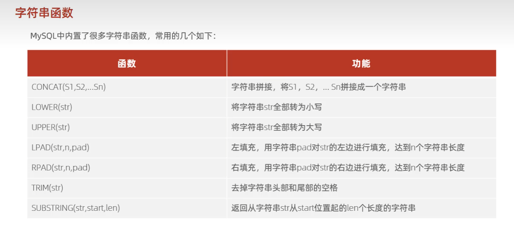
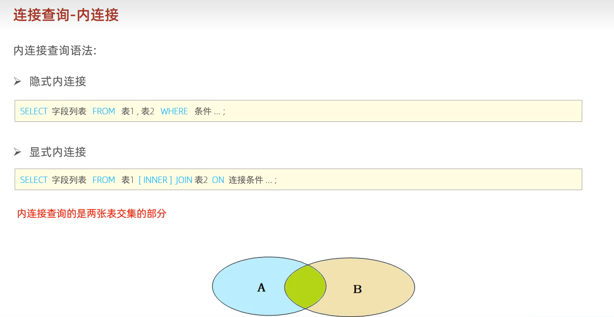
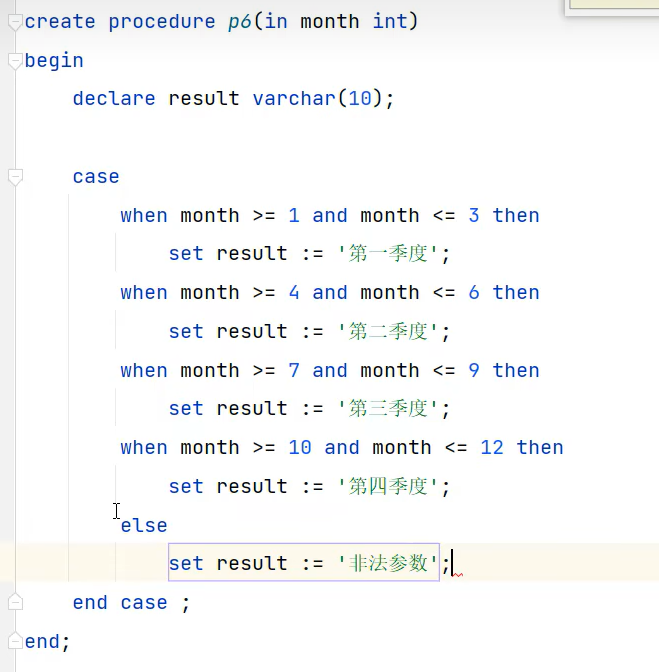
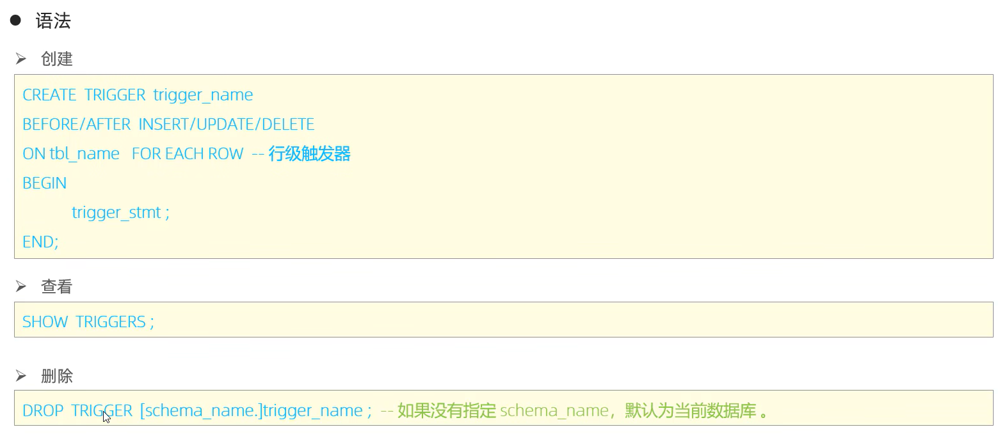
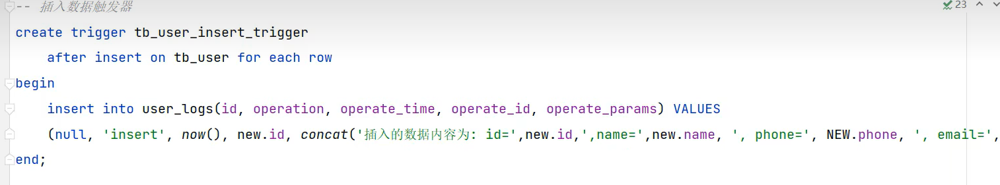

# 基础

## DDL 

### 数据库操作

``` sql
show databases ; // 查询所有数据库
select database() ;  // 查询当前数据库
create database [if not exists] 数据库名字 [default charset 字符集] [collate 排序规则] ;  // 创建数据库
drop database [if exists] 数据库名字 ;  // 删除数据库
use 数据库名字 ; // 使用数据库，切换数据库
```

### 二维表操作

```sql
show tables ; // 查询当前数据库的所有表
desc 表名 ;  // 查询表结构
show create table 表名 ;  // 查询指定表的建表语句
alter table 表名 rename to 新表名 ; // 修改表名
drop table [if exists] 表名 ; // 删除表
truncate table 表名 ; // 删除指定表，并重新创建该表

create table 表名(
	id int [comment '注释'],
    name varchar(50),
    age int,
    gender varchar(1)
) [comment 表注释] ;

show create table 表名 ; // 显示注释
```

``` sql
alter table 表名 add 字段名 类型 [comment 注释] ;  // 增加属性
alter table 表名 modify 字段名 新数据类型 ; // 修改数据类型
alter table 表名 change 旧字段名 新字段名 型数据类型 [comment 注释] [约束] ;  // 修改字段名和字段类型
alter table 表名 drop 字段名 ; 删除字段
```

## DML

```sql
 insert into 表名(字段1， 字段2) values(值1, 值2) ; // 添加数据
 insert into 表名 values(值1, 值2) ; // 添加数据
 insert into 表名(字段名1，字段名2) values(值1，值2)(值1，值2) ; // 添加多组数据
 insert into 表名 values(值1，值2)(值1，值2)(值1，值2) ; // 添加多组数据
```

```sql
update 表名 set 字段名1=值1， 字段名2=值2 [where 条件]
```

```sql
delete from 表名 [where 条件]
```


## DQL

```sql
select 
	字段列表[as]
from
	表名列表[as]
where
	条件列表
group by
	分组字段列表
having
	分组后条件列表
order by
	排序字段列表(asc 升序)(desc 降序)
limit
	分页参数(起始索引编号，每页的长度)
```

```sql
distinct 字段名 ; // 去除重复记录
```


## DCL

```sql
use mysql ; select * from user ; // 查询有多少用户
// 主机名写 % 是可以在任意主机登录
create user '用户名'@'主机名' identified by '密码' ; // 创建用户
alter user '用户名'@'主机名' identified with mysql_native_password by '密码' ;  // 修改用户密码
drop user '用户名'@'主机名' ; // 删除用户
```


```sql
show grants for '用户名'@'主机名' ;  // 查询权限
grant 权限列表 on 数据库名.表名 to '用户名'@'主机名' ; // 授予权限
revoke 权限列表 on 数据库名.表名 from '用户名'@'主机名' ;  // 撤销权限,可以用*，如*.*
```

## 函数

### 字符串函数



```sql
select concat(name, age) ;
select lower(name) ;
select upper(name) ;
select lpad(name, 10, '-') ;
select rpad(name, 10, '-') ;
select trim(name) ;
select substring(name, 1, 3) ;
```

### 数值函数


```sql
select ceil(age) ;
select floor(age) ;
select mod(x, y) ;
select rand() ;
select round(x, y) ;
```

### 日期函数


### 流程函数


## 约束


例子：


外键约束的更新删除行为：


## 多表查询

###  自然连接

```sql
select 字段列表 from 表1 nature join where 表2 ;
```


### 内连接



### 外连接


全外连接

```sql
full [nature] join ; // 外连接也都可以加nature,去除相同的
```

### 子查询

#### 标量子查询


例子：

#### 列子查询


例子：


#### 行子查询


例子：


#### 表子查询


例子：


## 事务

### 事务操作


例子：

### 事务特性


### 共发事务问题


### 事务的隔离级别


# 进阶

## 存储引擎

### 简介与创建


### 存储引擎的特点


### 存储引擎的选择


## 索引

### 索引概述


### 索引结构


**B-Tree**


**B+Tree**


**mysql中的B+Tree**


**Hash**


**原因**


### 索引分类


**思考题：**


### 索引语法


## 视图

### 介绍和语法


### 视图检查


## 存储过程

### 介绍


### 创建与调用


### 查看与删除


### 系统变量


### 用户变量


### 局部变量


### if


### case


**例子：**



### while


### repeat


### loop


**例子：**


### 游标


**例子：**


### 存储函数


**例子：**


## 触发器




**例子：**


