# 三、实验过程或算法（源程序）

```sql
create table teacher(
	T_ID varchar(255) primary key,
    TNAME varchar(255) not null,
    DEPT varchar(255),
    SALARY int check ( salary between 2000 and 1000000 )
) ;

create table student(
	SID varchar(255) primary key ,
    SNAME varchar(255) not null ,
    DEPT varchar(255) ,
    AGE int check ( age between 0 and 120 ),
    GENDER char(1) check ( gender in('F','M') )
);

create table course(
	CID varchar(255) primary key,
    CNAME varchar(255) not null,
    DEPT varchar(255),
    CREDITS decimal(2, 1) not null,
    TEACHER varchar(255)
) ;

create table SC(
	SID varchar(255) references student(SID) ,
    CID varchar(255) references course(CID) ,
    GRADE int check( grade between 0 and 100),
    primary key (SID, CID)
) ;

insert into teacher values ('14001','Katz','CS',75000),
                           ('14002','Crick','Biology',72000),
                           ('14003','Gold','Physics',87000),
                           ('14004','Einstein','Physics',95000),
                           ('14005','Kim','CS',65000),
                           ('14006','Wu','Finance',90000),
                           ('14007','Brandt','CS',65000),
                           ('14008','Singh','Finance',80000) ;

insert into student values  ('S1', 'Wangfeng', 'Physics', 20, 'M'),
                            ('S2', 'Liu fang', 'Physics', 19, 'M'),
                            ('S3', 'Chen yun', 'CS', 22, 'M'),
                            ('S4', 'Wu kai', 'Finance', 19, 'M'),
                            ('S5', 'Liu li', 'CS', 21, 'F'),
                            ('S6', 'Dongqing', 'Finance', 18, 'F'),
                            ('S7', 'Li', 'CS', 19, 'F'),
                            ('S8', 'Chen', 'CS', 21, 'F'),
                            ('S9', 'Zhang', 'Physics', 19, 'M'),
                            ('S10', 'Yang', 'CS', 22, 'F'),
                            ('S11', 'Wang', 'CS', 19, 'F') ;

insert into course values  ('C1', 'DB', 'CS', 2.0, 'Li'),
                            ('C2', 'maths', 'Mathematics', 2.0, 'Ma'),
                            ('C3', 'chemistry', 'Chemistry', 2.5, 'Zhou'),
                            ('C4', 'physics', 'Physics', 1.5, 'Shi'),
                            ('C5', 'OS', 'CS', 2.0, 'Wen'),
                            ('C6', 'Database', 'CS', 2.0, 'Katz'),
                            ('C7', 'Algorithm', 'CS', 2.5, 'Gold'),
                            ('C8', 'Java', 'CS', 1.5, 'Einstein'),
                            ('C9', 'Marketing', 'Finance', 2.0, 'Wu') ;

insert into  sc values  ('S1', 'C1', 70),
                        ('S1', 'C3', 81),
                        ('S2', 'C4', 92),
                        ('S2', 'C2', 85),
                        ('S3', 'C1', 65),
                        ('S3', 'C5', 57),
                        ('S4', 'C1', 87),
                        ('S5', 'C4', 83) ;


    update student
    set DEPT='CS'
    where SNAME = 'Zhang' and DEPT = 'Physics' ;

    delete from teacher
    where DEPT = 'Finance' ;

    update teacher
    set salary = case
                    when salary <= 70000 then salary * 1.1
                    else salary * 1.05
                end;

    select tname, salary
    from teacher
    where dept = 'Physics' or dept =  'Biology' ;

    SELECT DISTINCT dept
    FROM teacher;

    SELECT tname, salary*1.2
    FROM teacher;


    SELECT s.sname, s.dept, c.cname, c.credits
    FROM student s
    JOIN SC ON s.sid = SC.sid
    JOIN course c ON SC.cid = c.cid
    WHERE s.dept = 'CS' ;

    SELECT sname, age
    FROM student ;

    SELECT DISTINCT sname, age
    FROM student as s, sc
    WHERE sc.SID = s.SID ;

    SELECT DISTINCT sid
    FROM SC
    WHERE grade < 60;

    SELECT sname, gender, age
    FROM student
    WHERE age BETWEEN 20 AND 23;

    SELECT sid, sname, age
    FROM student
    WHERE sname LIKE 'Liu%';

    SELECT MAX(grade)
    FROM sc
    WHERE cid = 'C1' ;

    SELECT cid, count(*) as num
    FROM sc
    GROUP BY cid ;

    SELECT sname
    FROM sc JOIN student as s ON sc.sid = s.sid
    WHERE sc.CID = 'C3' ;

    SELECT cid, AVG(grade)
    FROM sc
    GROUP BY cid
    
    DELETE FROM sc
    WHERE sc.sid in
    (
        SELECT sid
        from student
        where dept = 'CS'
    ) and sc.cid not in
    (
        select cid
        from course
        where dept = 'CS'
    );

```

# 四、实验结果及分析和（或）源程序调试过程

## 1.创表

### teacher

该语句创建了一个名为teacher的表，包含四个列：T_ID、TNAME、DEPT和SALARY。其中，T_ID为主键，TNAME不为空，DEPT可以为空，SALARY必须在2000到1000000之间。

```sql
create table teacher(
	T_ID varchar(255) primary key,
    TNAME varchar(255) not null,
    DEPT varchar(255),
    SALARY int check ( salary between 2000 and 1000000 )
) ;

```


#### student

该语句创建了一个名为student的表，包含五个列：SID、SNAME、DEPT、AGE和GENDER。其中，SID为主键，SNAME不为空，DEPT可以为空，AGE必须在0到120之间，GENDER为单个字符，取值为'F'或'M'。

```sql
create table student(
	SID varchar(255) primary key ,
    SNAME varchar(255) not null ,
    DEPT varchar(255) ,
    AGE int check ( age between 0 and 120 ),
    GENDER char(1) check ( gender in('F','M') )
);
```


#### course

该语句创建了一个名为course的表，包含五个列：CID、CNAME、DEPT、CREDITS和TEACHER。其中，CID为主键，CNAME不为空，DEPT可以为空，CREDITS为小数类型，保留一位小数，不能为null，TEACHER可以为空。

```sql
create table course(
	CID varchar(255) primary key,
    CNAME varchar(255) not null,
    DEPT varchar(255),
    CREDITS decimal(2, 1) not null,
    TEACHER varchar(255)
) ;
```


### SC

该语句创建了一个名为SC的表，包含三个列：SID、CID和GRADE。其中，SID和CID都是外键，分别参考表student和course的主键，组成了复合主键。GRADE必须在0到100之间。

```sql
create table SC(
	SID varchar(255) references student(SID) ,
    CID varchar(255) references course(CID) ,
    GRADE int check( grade between 0 and 100),
    primary key (SID, CID)
) ;
```


## 2.修改

### 1）插入数据

```sql
insert into teacher values ('14001','Katz','CS',75000),
                           ('14002','Crick','Biology',72000),
                           ('14003','Gold','Physics',87000),
                           ('14004','Einstein','Physics',95000),
                           ('14005','Kim','CS',65000),
                           ('14006','Wu','Finance',90000),
                           ('14007','Brandt','CS',65000),
                           ('14008','Singh','Finance',80000) ;

insert into student values  ('S1', 'Wangfeng', 'Physics', 20, 'M'),
                            ('S2', 'Liu fang', 'Physics', 19, 'M'),
                            ('S3', 'Chen yun', 'CS', 22, 'M'),
                            ('S4', 'Wu kai', 'Finance', 19, 'M'),
                            ('S5', 'Liu li', 'CS', 21, 'F'),
                            ('S6', 'Dongqing', 'Finance', 18, 'F'),
                            ('S7', 'Li', 'CS', 19, 'F'),
                            ('S8', 'Chen', 'CS', 21, 'F'),
                            ('S9', 'Zhang', 'Physics', 19, 'M'),
                            ('S10', 'Yang', 'CS', 22, 'F'),
                            ('S11', 'Wang', 'CS', 19, 'F') ;

insert into course values  ('C1', 'DB', 'CS', 2.0, 'Li'),
                            ('C2', 'maths', 'Mathematics', 2.0, 'Ma'),
                            ('C3', 'chemistry', 'Chemistry', 2.5, 'Zhou'),
                            ('C4', 'physics', 'Physics', 1.5, 'Shi'),
                            ('C5', 'OS', 'CS', 2.0, 'Wen'),
                            ('C6', 'Database', 'CS', 2.0, 'Katz'),
                            ('C7', 'Algorithm', 'CS', 2.5, 'Gold'),
                            ('C8', 'Java', 'CS', 1.5, 'Einstein'),
                            ('C9', 'Marketing', 'Finance', 2.0, 'Wu') ;

insert into  sc values  ('S1', 'C1', 70),
                        ('S1', 'C3', 81),
                        ('S2', 'C4', 92),
                        ('S2', 'C2', 85),
                        ('S3', 'C1', 65),
                        ('S3', 'C5', 57),
                        ('S4', 'C1', 87),
                        ('S5', 'C4', 83) ;
```

### 2）修改student表中姓名为’Zhang’且系信息错填为’Physics’的同学的系为’CS’的语句：

```sql
update student
set DEPT='CS'
where SNAME = 'Zhang' and DEPT = 'Physics' ;
```

该语句中，通过where关键字指定了符合条件的行（即姓名为’Zhang’且系信息错填为’Physics’的同学），并使用set关键字指定了要修改的列和新的值。

### 3）删除teacher表中属于Finance学院的教师信息的语句：

```sql
delete from teacher
where DEPT = 'Finance' ;
```

该语句中，使用delete关键字删除符合条件（即属于Finance学院的教师信息）的行。

### 4）将teacher表中工资低于或等于70000的教师增长10%的工资，工资高于70000的教师增长5%的工资的语句：

```sql
update teacher
set salary = case
                when salary <= 70000 then salary * 1.1
             else salary * 1.05
end;
```

该语句中，使用了case语句来根据不同的条件进行不同的操作，实现了对工资的增长。

## 3.基本数据查询 

### 1）基于teacher表，找出“物理系Physics和生物系Biology”所有教师的名字和工资的语句：

```sql
select tname, salary
from teacher
where dept = 'Physics' or dept =  'Biology' ;
```

该语句中，使用了where关键字根据条件过滤出所需数据，并通过select关键字选择要查询的列。

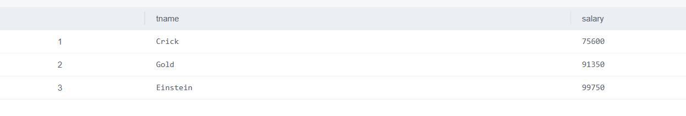

### 2）基于teacher表，列出教师所在的各个系名，要求每个系名仅出现一次的语句：

```sql
SELECT DISTINCT dept
FROM teacher;
```

该语句中，使用了distinct关键字来去重，排除重复的系名。


### 3）基于teacher表，希望查看“若将每位教师的工资提高20%后”各位教师的姓名和工资是多少的语句：

```sql
SELECT tname, salary*1.2
FROM teacher;
```

该语句中，通过select关键字将提高工资后的结果输出到结果集，使用计算公式将原工资乘以1.2而得到提高后的工资。

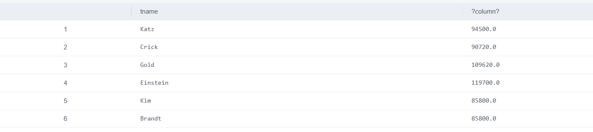

### 4）基于表student、SC和course，查看到计算机系CS的每位学生所选课程的所有信息，包括学生姓名、所在系、课程名称、课程学分的情况的语句：

```sql
SELECT s.sname, s.dept, c.cname, c.credits
FROM student s
JOIN SC ON s.sid = SC.sid
JOIN course c ON SC.cid = c.cid
WHERE s.dept = 'CS' ;
```

该语句中，使用了join关键字将三张表连接在一起，使用了where关键字根据条件过滤出符合要求的数据。

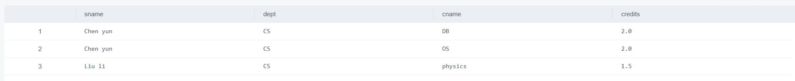

## 4.复杂数据查询 

### 1）查询全体学生的姓名、年龄的语句：

```sql
SELECT sname, age
FROM student ;
```

该语句中，通过select关键字选择要查询的列，从student表中查询出所有学生的姓名和年龄信息。

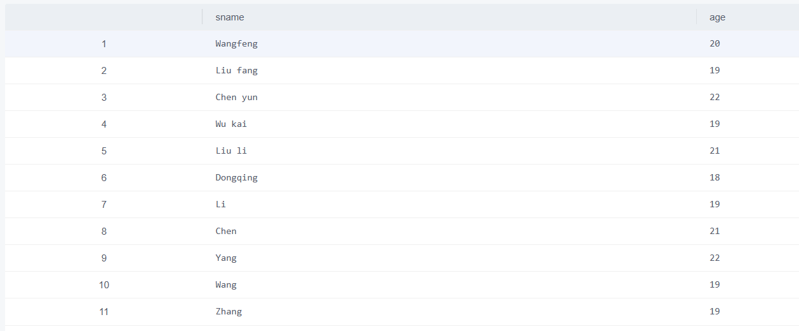

### 2）查询所有选修过课的学生的学号的语句：

```sql
SELECT DISTINCT sid
FROM SC
WHERE grade < 60;
```

该语句中，使用了distinct关键字去重，排除重复的学号。

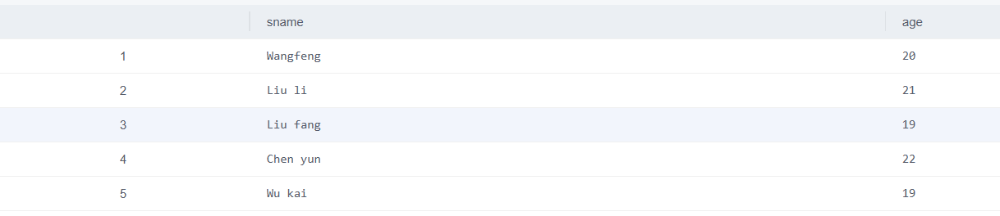

### 3）查询考试成绩低于60分的学生的学号的语句：

```sql
SELECT DISTINCT sid
FROM SC
WHERE grade < 60;
```

该语句中，使用了distinct关键字去重，排除重复的学号，并在where语句中添加条件限制。


### 4）查询年龄在20至23之间的学生姓名、性别和年龄的语句：

```
SELECT sname, gender, age
FROM student
WHERE age BETWEEN 20 AND 23;
```

该语句中，使用了between…and…的语法结构，指定age的取值范围。

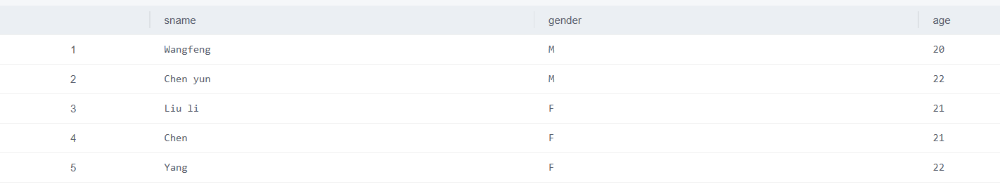

### 5）查询所有姓liu的学生的学号、姓名和年龄的语句：

```sql
SELECT sid, sname, age
FROM student
WHERE sname LIKE 'Liu%';
```

该语句中，使用了like关键字指定模糊查询的匹配规则。

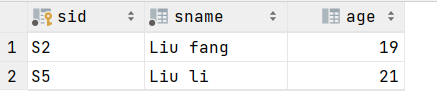

### 6）查询学习C1课程的学生最高分数的语句：

```sql
SELECT MAX(grade)
FROM sc
WHERE cid = 'C1' ;
```

该语句中，使用了max函数来查询最高分数，并在where语句中添加条件限制。


### 7）查询各个课程号与相应的选课人数的语句：

```sql
SELECT cid, count(*) as num
FROM sc
GROUP BY cid ;
```

该语句中，使用了count函数对相应的课程号进行计数，并通过group by关键字将数据按照cid进行分组。

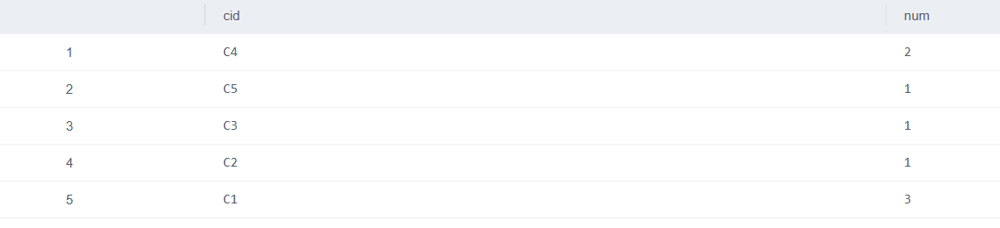

### 8）查询选修C3课程的学生的姓名的语句：

```sql
SELECT sname
FROM sc JOIN student as s ON sc.sid = s.sid
WHERE sc.CID = 'C3' ;
```

该语句中，使用了join连接两张表，并通过where关键字限制CID为'C3'的行，从而得到选修C3课程的学生姓名。

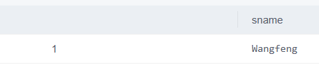

### 9）查询每一门课程的平均成绩的语句：

```sql
SELECT cid, AVG(grade)
FROM sc
GROUP BY cid;
```

该语句中，使用了avg函数计算平均成绩，并通过group by关键字将数据按照cid进行分组。

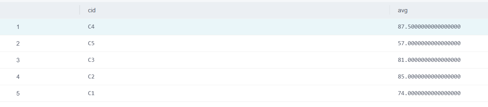


## 5.选做题目

学生只能选择自己学院开设的课程。发现CS学院有的同学选择了其他学院开设的课程。在SC表中删除这些错选的记录。

```sql
DELETE FROM sc
WHERE sc.sid in
(
    SELECT sid
    from student
    where dept = 'CS'
) and sc.cid not in
(
    select cid
    from course
    where dept = 'CS'
);

```

删除的学生

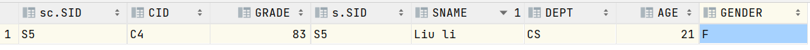

该 SQL 语句通过两个子查询来筛选出需要删除的记录。第一个子查询选择了 CS 学院内的学生 ID，第二个子查询选择了不属于 CS 学院的课程 ID。最终主查询会根据这两个条件组成的逻辑进行删除操作。

