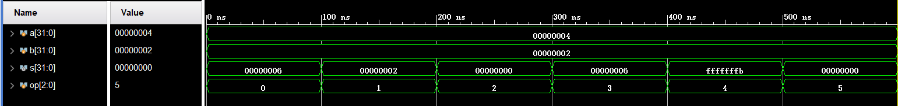
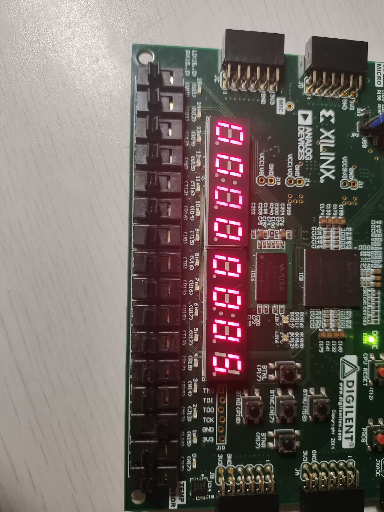
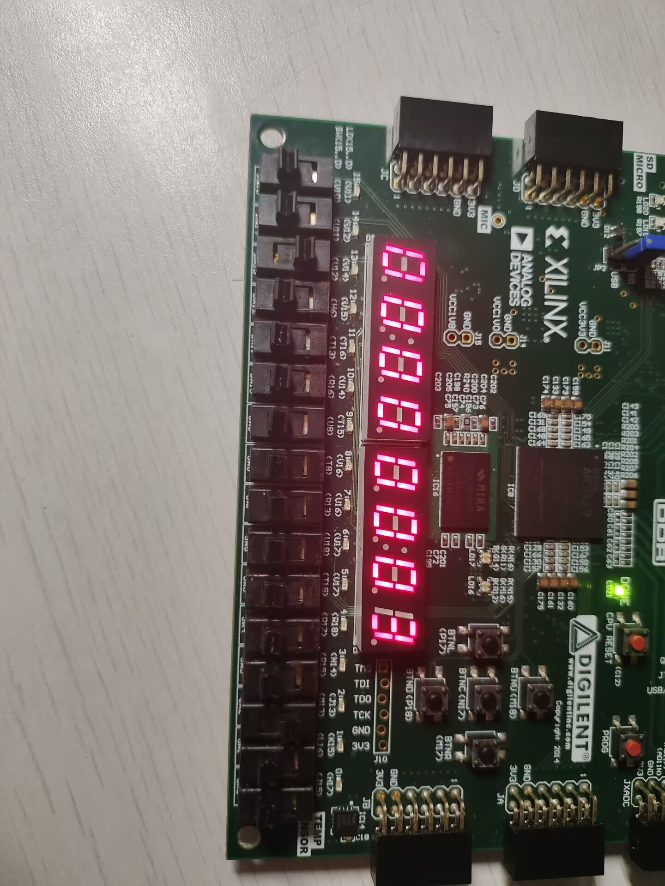
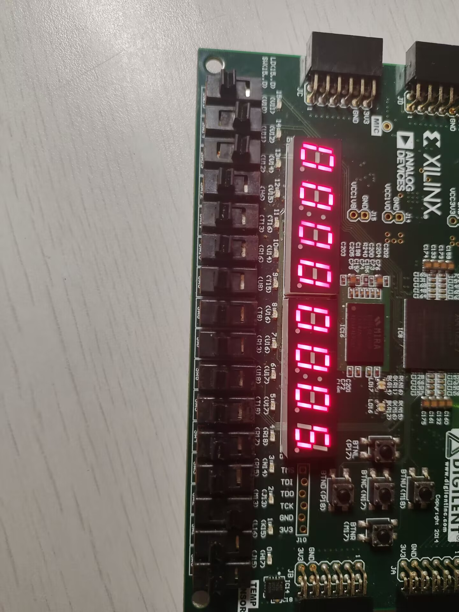
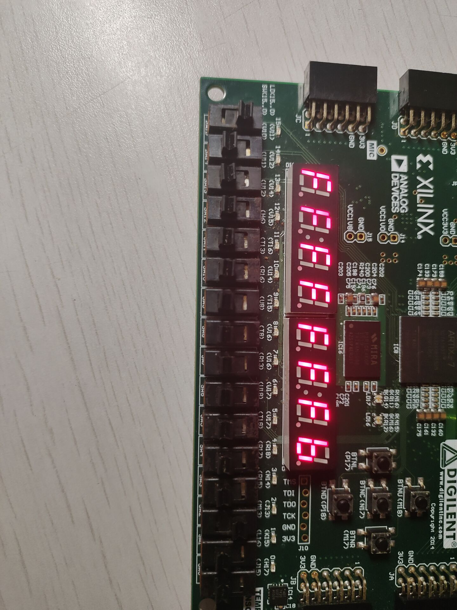
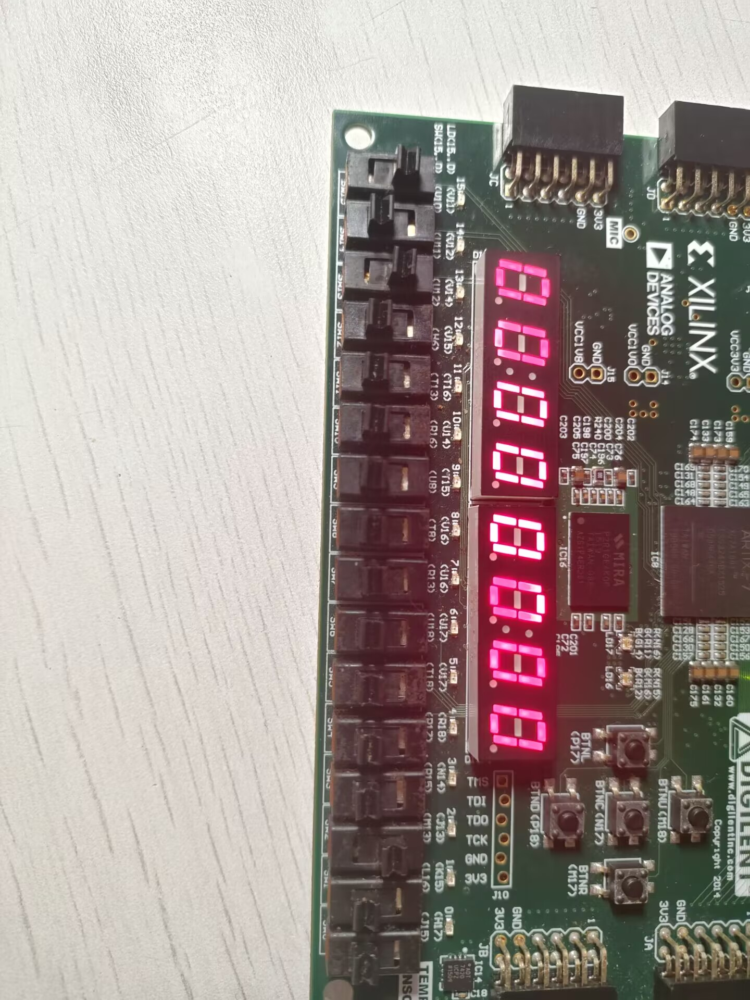
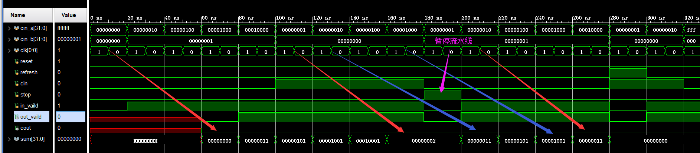
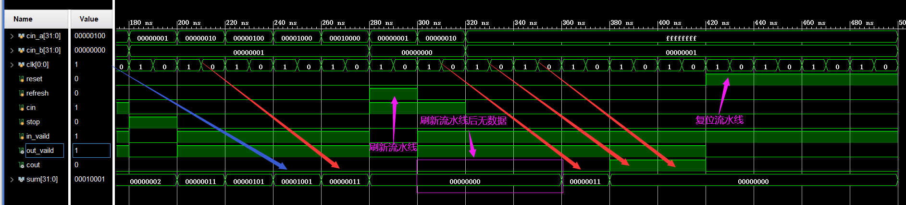

# 计组

## ALU

### ALU 仿真图



### top代码

```verilog
module top(
    input wire clk,reset,
    input wire [2:0] op,
    input wire [7:0] num1,
    output wire [6:0]seg,
    output wire [7:0]ans
    );
    
    wire [31:0] s ;
    display U1(
        .clk(clk),
        .reset(reset),
        .s(s),
        .seg(seg),
        .ans(ans)
    );
    alu U2(
        .a({24'b0, num1}),
        .b(32'h1),
        .op(op),
        .s(s)
    );
endmodule

```

### ALU代码

```verilog
module alu(
    input wire [31:0] a,
    input wire [31:0] b,
    input wire [2:0] op,
    output reg [31:0] s
    );
    always @(*) begin
        case(op) 
            3'b000: begin
                s <= (a + b) ;
            end
            3'b001: begin
                s <= (a - b) ;
            end
            3'b010: begin
                s <= (a & b) ;
            end
            3'b011: begin
                s <= (a | b) ;
            end
            3'b100: begin
                s <= (~a) ;
            end
            3'b101: begin
                s <= (a < b) ;
            end
            default: begin
                s <= 32'b0 ;
            end
        endcase
    end
endmodule
```

### testbench代码

```verilog
module testbench(
    
    );

    reg[31:0] a ;
    reg[31:0] b ;
    wire[31:0] s ;
    reg[2:0] op ;

    alu U1(
        .a(a),
        .b(b),
        .op(op),
        .s(s)
    );
    
    initial begin
        a = 4 ;
        b = 2 ;
        op = 3'b000 ;
        ##100
        a = 4 ;
        b = 2 ;
        op = 3'b001 ;
        ##100
        a = 4 ;
        b = 2 ;
        op = 3'b010 ;
        ##100
        a = 4 ;
        b = 2 ;
        op = 3'b011 ;
        ##100
        a = 4 ;
        b = 2 ;
        op = 3'b100 ;
        ##100
        a = 4 ;
        b = 2 ;
        op = 3'b101 ;
        ##100 $finish ;
    end
endmodule
```

### 上板子

+
















## 加法流水线

### pipeline_32bits_full_adder代码

```verilog
module pipeline_32bits_full_adder(
    input wire       reset,    // 复位信号
    
    input wire[31:0] cin_a,    // 输入num1
    input wire[31:0] cin_b,    // 输入num2
    input wire       cin,      // 输入低位进位
    input wire       in_vaild, // 输入信号是否有效
    
    input wire       clk,      // 时钟信号
    input wire       stop,     // 暂停信号
    input wire       refresh,  // 刷新信号
    
    output reg       out_vaild,// 输出是否有效
    output reg       cout,     // 输出的进位信号
    output reg[31:0] sum       // 输出的和
);

//各级流水线间临时寄存器(保存未计算的高位输入)
reg [23:0] a_t1, b_t1; //第一、二级间
reg [15:0] a_t2, b_t2; //第二、三级间
reg [7:0]  a_t3, b_t3; //第三、四级间

// 各级流水线进位输出寄存器
reg c_out_t1 , c_out_t2 , c_out_t3 ;  

// 各级流水线输出寄存器
reg [7:0] sum_out_t1 ;
reg [15:0] sum_out_t2 ;
reg [23:0] sum_out_t3 ;

// 各级流水线输出是够有效寄存器
reg in_vaild_t1 ;
reg in_vaild_t2 ;
reg in_vaild_t3 ;

always @( posedge clk ) begin
    if(reset || refresh) begin
        sum_out_t1 <= 0 ;
        sum_out_t2 <= 0 ;
        sum_out_t3 <= 0 ;
        c_out_t1 <= 0 ; 
        c_out_t2 <= 0 ;
        c_out_t3 <= 0 ;
        a_t1 <= 0 ; b_t1 <= 0 ;
        a_t2 <= 0 ; b_t2 <= 0 ;
        a_t3 <= 0 ; b_t3 <= 0 ;
        out_vaild <= 0 ;
        cout <= 0 ;
        sum <= 0 ;
    end
    else if(stop)
        sum_out_t1 <= sum_out_t1;
    else begin
        { c_out_t1 , sum_out_t1 } <= {1'b0 , cin_a [7:0]} + {1'b0 , cin_b[7:0]} + cin ;
        a_t1 <= cin_a[31:8] ; b_t1 <= cin_b[31:8] ;
        in_vaild_t1 <= in_vaild ;
    end
end

always @( posedge clk ) begin
    if(reset || refresh) begin
        sum_out_t1 <= 0 ;
        sum_out_t2 <= 0 ;
        sum_out_t3 <= 0 ;
        c_out_t1 <= 0 ; 
        c_out_t2 <= 0 ;
        c_out_t3 <= 0 ;
        a_t1 <= 0 ; b_t1 <= 0 ;
        a_t2 <= 0 ; b_t2 <= 0 ;
        a_t3 <= 0 ; b_t3 <= 0 ;
        out_vaild <= 0 ;
        cout <= 0 ;
        sum <= 0 ;
    end
    else if(stop)
        sum_out_t2 <= sum_out_t2;
    else begin
        { c_out_t2 , sum_out_t2 } <= {{1'b0 , a_t1 [7:0]} + {1'b0 ,b_t1 [7:0]} + c_out_t1 , sum_out_t1 };
        a_t2 <= a_t1[23:8] ; b_t2 <= b_t1[23:8] ;
        in_vaild_t2 <= in_vaild_t1 ;
    end
end

always @( posedge clk ) begin
    if(reset || refresh) begin
        sum_out_t1 <= 0 ;
        sum_out_t2 <= 0 ;
        sum_out_t3 <= 0 ;
        c_out_t1 <= 0 ; 
        c_out_t2 <= 0 ;
        c_out_t3 <= 0 ;
        a_t1 <= 0 ; b_t1 <= 0 ;
        a_t2 <= 0 ; b_t2 <= 0 ;
        a_t3 <= 0 ; b_t3 <= 0 ;
        out_vaild <= 0 ;
        cout <= 0 ;
        sum <= 0 ;
    end
    else if(stop)
        sum_out_t3 <= sum_out_t3;
    else begin
        { c_out_t3 , sum_out_t3 } <= {{1'b0 , a_t2 [7:0]} + {1'b0 ,b_t2 [7:0]} + c_out_t2 , sum_out_t2 };
        a_t3 <= a_t2[15:8] ; b_t3 <= b_t2[15:8] ;
        in_vaild_t3 <= in_vaild_t2 ;
    end
end

always @( posedge clk ) begin
    if(reset || refresh) begin
        sum_out_t1 <= 0 ;
        sum_out_t2 <= 0 ;
        sum_out_t3 <= 0 ;
        c_out_t1 <= 0 ; 
        c_out_t2 <= 0 ;
        c_out_t3 <= 0 ;
        a_t1 <= 0 ; b_t1 <= 0 ;
        a_t2 <= 0 ; b_t2 <= 0 ;
        a_t3 <= 0 ; b_t3 <= 0 ;
        out_vaild <= 0 ;
        cout <= 0 ;
        sum <= 0 ;
    end
    else if(stop) begin
        sum <= sum;
        out_vaild <= 0 ;
    end 
    else begin
        { cout , sum } <= {{1'b0 , a_t3 [7:0]} + {1'b0 ,b_t3 [7:0]} + c_out_t3 , sum_out_t3 };
        out_vaild <= in_vaild_t3 ;
    end
end

endmodule

```

### testbench代码

```verilog
module testbench( );
    reg [31:0]  cin_a;
    reg [31:0]  cin_b;
    reg [0:0]   clk;
    reg         reset;
    reg         refresh;
    reg         cin;
    reg         stop;
    reg         in_vaild;
    wire        out_vaild;
    wire        cout;
    wire[31:0]  sum;
    
    initial begin
        clk = 1;
        reset = 0;
        stop = 0;
        refresh = 0 ;
        cin_a = 32'h0000_0000;
        cin_b=32'h0000_0000;
        cin=1'b0;
        in_vaild = 0 ;
        
        @(posedge clk) cin_a = 32'h0000_0010;cin_b = 32'h0000_0001;cin = 1'b0;in_vaild = 1'b1;                   // a = 16     b = 1  cin = 0
        @(posedge clk) cin_a = 32'h0000_0100;cin_b = 32'h0000_0001;cin = 1'b0;in_vaild = 1'b1;                   // a = 256    b = 1  cin = 0
        @(posedge clk) cin_a = 32'h0000_1000;cin_b = 32'h0000_0001;cin = 1'b0;in_vaild = 1'b1;                   // a = 4096   b = 1  cin = 0
        @(posedge clk) cin_a = 32'h0001_0000;cin_b = 32'h0000_0001;cin = 1'b0;in_vaild = 1'b1;                   // a = 65536  b = 1  cin = 0
        @(posedge clk) cin_a = 32'h0000_0001;cin_b = 32'h0000_0000;cin = 1'b1;in_vaild = 1'b1;                   // a = 1      b = 0  cin = 1
        @(posedge clk) cin_a = 32'h0000_0010;cin_b = 32'h0000_0000;cin = 1'b1;in_vaild = 1'b1;                   // a = 16     b = 0  cin = 1
        @(posedge clk) cin_a = 32'h0000_0100;cin_b = 32'h0000_0000;cin = 1'b1;in_vaild = 1'b1;                   // a = 256    b = 0  cin = 1
        @(posedge clk) cin_a = 32'h0000_1000;cin_b = 32'h0000_0000;cin = 1'b1;in_vaild = 1'b1;                   // a = 4096   b = 0  cin = 1
        // 第十周期暂停流水线， stop = 1                                       
        @(posedge clk) stop = 1'b1;cin_a = 32'h0000_0001;cin_b = 32'h0000_0001;cin = 1'b0;in_vaild = 1'b0;       // a = 1          b = 1  cin = 0  
        // 恢复流水线
        @(posedge clk) stop = 1'b0;cin_a = 32'h0000_0010;cin_b = 32'h0000_0001;cin = 1'b0;in_vaild = 1'b1;       // a = 16         b = 1  cin = 0
        @(posedge clk) cin_a = 32'h0000_0100;cin_b = 32'h0000_0001;cin = 1'b0;in_vaild = 1;                      // a = 256        b = 1  cin = 0
        @(posedge clk) cin_a = 32'h0000_1000;cin_b = 32'h0000_0001;cin = 1'b0;in_vaild = 1;                      // a = 4096       b = 1  cin = 0
        @(posedge clk) cin_a = 32'h0001_0000;cin_b = 32'h0000_0001;cin = 1'b0;in_vaild = 1;                      // a = 65536      b = 1  cin = 0
        // 第十五周期刷新第三级流水线，refresh = 1
        @(posedge clk) refresh = 1'b1;cin_a = 32'h0000_0001;cin_b = 32'h0000_0000;cin = 1'b1;in_vaild = 0;      // a = 1          b = 0  cin = 1 
        // 取消刷新
        @(posedge clk) refresh = 1'b0;cin_a = 32'h0000_0010;cin_b = 32'h0000_0000;cin = 1'b1;in_vaild = 1;      // a = 16         b = 0  cin = 1 
        @(posedge clk) cin_a = 32'hffff_ffff;cin_b = 32'h0000_0001;cin = 1'b0;in_vaild = 1;                     // a = ffff_ffff  b = 1  cin = 0
        @(posedge clk) cin_a = 32'hffff_ffff;cin_b = 32'h0000_0001;cin = 1'b0;in_vaild = 1;                     // a = ffff_ffff  b = 1  cin = 0
        // 等待四个周期
        repeat(4) @(posedge clk);
        // 复位
        reset = 1 ;
        repeat(4) @(posedge clk);
        $finish;       
    end
    
    always ##10  clk = ~clk;

    pipeline_32bits_full_adder U1(
        .reset(reset),
        .cin_a(cin_a),
        .cin_b(cin_b),
        .cin(cin),
        .in_vaild(in_vaild),
        .clk(clk),
        .stop(stop),
        .refresh(refresh),
        .out_vaild(out_vaild),
        .cout(cout),
        .sum(sum)
    );

endmodule
```

### 仿真图







    input wire       reset,    // 复位信号
    
    input wire[31:0] cin_a,    // 输入num1
    input wire[31:0] cin_b,    // 输入num2
    input wire       cin,      // 输入低位进位
    input wire       in_vaild, // 输入信号是否有效
    
    input wire       clk,      // 时钟信号
    input wire       stop,     // 暂停信号
    input wire       refresh,  // 刷新信号
    
    output reg       out_vaild,// 输出是否有效
    output reg       cout,     // 输出的进位信号
    output reg[31:0] sum       // 输出的和
    
    \caption{接口定义}\label{tab:signaldef}
    \begin{center}
    	\begin{tabular}{|l|l|l|p{6cm}|}
    	\hline
    	\textbf{信号名} & \textbf{方向} & \textbf{位宽} & \textbf{功能描述}\\ \hline \hline
    	a			& Input& 32-bit & 第一个操作数.\\ 
    	\hline
     	b			& Input& 32-bit & 第二个操作数.\\ 
    	\hline
     	op			& Input& 3-bit & 操作码.\\ 
    	\hline
            s			& Output& 32-bit & 输出结果.\\ 
    	\hline
    	\end{tabular}
    \end{center}
    \end{table}
    将上面的代码转成下面的latex

